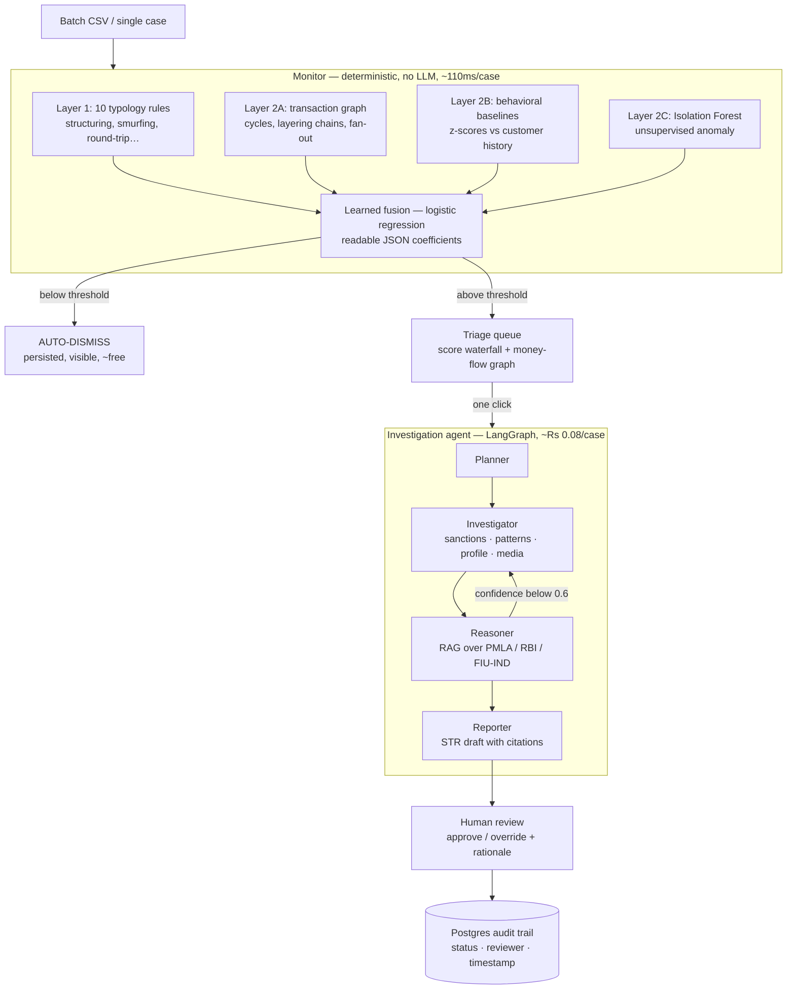

# Vigil

> An AML triage and investigation platform for Indian financial institutions.
> A four-layer deterministic/statistical/ML monitor screens whole batches of
> customers for **fractions of a paisa per case**, a learned fusion model turns
> the signals into an explainable risk score, and only the cases that clear the
> gate reach the **LLM investigation agent** (~₹0.08/case) — which screens
> sanctions, applies PMLA/RBI regulation via RAG, and drafts a citation-grounded
> **STR report** for a human reviewer whose decision is persisted to an audit trail.

**Stack:** Python · LangGraph · OpenAI GPT-4o-mini · Postgres + pgvector (CocoIndex incremental RAG) · scikit-learn · FastAPI · vanilla JS UI

---

## The problem

AML compliance teams drown in alerts: industry false-positive rates on automated
monitoring commonly exceed **90–95%**, and India's FIU-IND receives millions of
STRs a year. The expensive part isn't detection — it's *triage and write-up*:
reading the case, checking sanctions, recalling the right PMLA rule, and writing
a defensible report. Vigil's answer is economic: spend nearly nothing on the
obvious cases, spend an LLM on the ambiguous ones, and keep a human on the final
call with every decision recorded.

---

## Architecture



The **LLM plans, reasons, and writes — it never does arithmetic.** Every number
(amounts, counts, scores, costs) comes from deterministic Python.

---

## Honest results

### Independent benchmark — SAML-D (9.5M transactions, 0.104% laundering)

The monitor stack was benchmarked against
[SAML-D](https://www.kaggle.com/datasets/berkanoztas/synthetic-transaction-monitoring-dataset-aml)
(IEEE 2023) — a public AML dataset the detectors were **never written against**.
2,450 sampled account-level cases (461 laundering / 1,989 clean), seed-fixed and
reproducible. Two calibration passes (a structuring proportionality fix and the
learned fusion) produced:

| | Before | After |
|---|---|---|
| At matched recall ~0.80 | FPR 0.455 · precision 0.287 | **FPR 0.343 · precision 0.352** |
| At threshold 0.60 | P 0.287 / R 0.790 / FPR 0.455 | P 0.356 / R 0.642 / **FPR 0.269** |

Read as a triage gate: **~80% of laundering accounts caught while safely
auto-dismissing a third of the book** — on foreign-shaped data with the
India-specific detectors (sanctions list, geography) structurally disabled.
Full sweep, methodology, and caveats: [`benchmarks/RESULTS_SAML_D.md`](benchmarks/RESULTS_SAML_D.md).
The enriched sample means precision does **not** transfer to production base
rates; recall and FPR do.

### Synthetic holdout (agent end-to-end)

A 40-case holdout locked from the first commit scores perfect —
which honestly means the agent *wires its tools together correctly*, not that it
survives real bank data. The synthetic benchmark is separable by design; see
[Where it still fails](#where-it-still-fails).

### Cost economics (measured, not estimated)

Token usage is counted per investigation by a callback and priced in Python:
**~5,000 tokens ≈ ₹0.08 per LLM investigation**; monitor triage is ~110ms of CPU.
The dashboard shows live spend and the amount saved by auto-dismissal.

---

## What the UI does

- **Batch triage** — upload a transaction CSV (sample provided), screen every
  customer through all four layers in seconds, and get a risk-sorted queue with
  a noise-reduction headline.
- **Explainability on every case** — click a queue row: a **score waterfall**
  shows each feature's exact contribution (the fusion is linear, so the chart is
  the actual math, not a post-hoc explanation), beside a **money-flow graph**
  with detected rings/fan-outs highlighted.
- **One-click investigation** — flagged cases go to the LangGraph agent with
  their monitor evidence attached (no re-screening); progress streams live; the
  STR renders with citations down to rule and page.
- **Human review + audit trail** — approve or override with a rationale; the
  case moves `flagged → in_review → str_filed / dismissed`, and every action is
  persisted to Postgres (PMLA record-keeping is a 5-year obligation — the audit
  trail *is* the product).
- **Case history & drawer** — every screened case, filterable by status, with a
  full-detail drawer: score breakdown, money flow, report, review log.
- **Live dashboard** — cases screened, STRs filed, noise auto-dismissed, LLM
  spend, and estimated savings, computed from persisted history.

---

## Quickstart

### Docker (recommended)

```bash
git clone https://github.com/theparthgupta/Vigil && cd Vigil
OPENAI_API_KEY=sk-... docker compose up --build
# first boot embeds the regulatory corpus (a few minutes, pennies of embedding spend)
# then open http://localhost:8000/
```

### Manual

Requires Postgres with the pgvector extension and a `vigil` database.

```bash
python -m venv venv && source venv/bin/activate   # Windows: venv\Scripts\activate
pip install -r requirements.txt
cp .env.example .env    # set OPENAI_API_KEY and DATABASE_URL
uvicorn api.main:app --reload                      # http://localhost:8000/
```

The RAG corpus and the anomaly model build themselves on first startup
(idempotent). To rebuild the corpus explicitly: `python rag/run_cocoindex_ingest.py`
— CocoIndex tracks source lineage and re-embeds **only changed files**.

### Reproduce the numbers

```bash
pytest -q                                          # 147 tests
python benchmarks/saml_d.py                        # SAML-D sweep (deterministic, seed 42)
python benchmarks/train_fusion.py                  # fusion coefficients + held-out tables
python eval/run_eval.py --tag holdout --cases data/cases_holdout.json --out eval/results_holdout.json
```

---

## Regulatory corpus

~928 section-aware chunks across 5 Indian AML documents, embedded with
`text-embedding-3-small` into pgvector via a declarative **CocoIndex** flow
(incremental: only changed PDFs re-embed; deleted files' chunks are pruned).
Chunking respects legal section boundaries so citations stay intact — including
correctly distinguishing the **statutory STR deadline ("promptly", PMLA Rules
Rule 8(2))** from the commonly-quoted-but-wrong "7 working days".

| # | Document | Chunks | Source |
|---|---|---|---|
| 1 | Prevention of Money-Laundering Act, 2002 | 158 | committed (`regs/A2003-15.pdf`) |
| 2 | PMLA (Maintenance of Records) Rules, 2005 | 35 | committed (`regs/PMLA_Rules.pdf`) |
| 3 | RBI KYC Master Direction, 2025 | 226 | committed (`regs/169MD.pdf`) |
| 4 | FIU-IND Reporting Format v1.14 (FINnet 2.0) | 22 | **restricted — download manually** from [fiuindia.gov.in](https://fiuindia.gov.in) as `regs/Reporting_Format.pdf` (ingest skips it if absent) |
| 5 | APG Yearly Typologies Report, 2024 | 487 | committed (`regs/2024_APG_Typologies_Report.pdf`) |

---

## Where it still fails

The most important section for anyone evaluating this work.

1. **Synthetic agent scores ≠ real-world proof.** The end-to-end agent benchmark
   is separable by design. The SAML-D numbers are the honest external signal —
   and SAML-D is itself simulator-generated.
2. **The fusion is calibrated to SAML-D.** Its coefficients (readable in
   [`benchmarks/fusion_weights.json`](benchmarks/fusion_weights.json)) reflect that
   dataset; on genuinely different data the hand-tuned fallback may be safer —
   deleting the JSON reverts instantly. The Isolation Forest layer is provably
   weak (retraining moved metrics <2 points) and is documented as such.
3. **Sanctions screening quality.** The local fuzzy list is a demo fallback;
   the OpenSanctions API path exists but real Indian-name screening needs
   transliteration-aware matching (Mohammed/Muhammad/Mohd) that `difflib` can't do.
4. **Mandatory tools are prompt-enforced, not code-enforced** in the agent
   planner; production should hard-code the baseline tool set.
5. **No authentication or maker-checker.** Reviewers type their name; real
   deployments need identity and two-person control.
6. **Docker packaging is authored but was not executed on the dev machine**
   (no Docker locally) — dependency wheels and startup paths were verified
   independently; first `compose up` on a Docker machine is the real test.

---

## Tech stack

| Layer | Choice | Why |
|---|---|---|
| Triage monitor | **Deterministic Python + NetworkX + scikit-learn** | 4 layers, no LLM, ~110ms/case, fully testable |
| Score fusion | **Logistic regression → plain JSON** | Learned from data, still a readable weighted sum |
| Orchestration | **LangGraph** | Explicit state-machine agent with a bounded loop |
| LLM | **OpenAI GPT-4o-mini** (temp 0) | Cheap, deterministic enough for eval; ~₹0.08/case measured |
| RAG | **Postgres + pgvector via CocoIndex** | Incremental indexing, section-aware chunks, one DB for everything |
| Persistence | **Postgres (plain psycopg2)** | Case lifecycle + review audit trail |
| Backend | **FastAPI** | API + UI + SSE streaming from one process |
| Frontend | **Vanilla HTML/CSS/JS + SVG** | No build step; waterfall and force-graph are ~200 lines of SVG |
| Observability | **LangSmith** (optional) | Traced runs, tagged per experiment |

---

## Project layout

```
monitor/     4-layer detection stack + learned fusion + triage pipeline
agent/       LangGraph graph, nodes, prompts, cost tracking
rag/         CocoIndex flow, pgvector retrieval (Chroma legacy kept as fallback)
tools/       deterministic investigative tools (sanctions, patterns, profile, media)
api/         FastAPI app + case-lifecycle store (audit trail)
app/         static single-page UI
benchmarks/  SAML-D harness, FP attribution, fusion training, results
eval/        synthetic eval harness + locked holdout
data/        synthetic case generator + labelled splits
regs/        source regulatory PDFs
```

**[DECISIONS.md](DECISIONS.md)** is the full engineering narrative — every
significant decision, its tradeoffs, its failure modes, and how it was verified,
appended chronologically across all 13 phases.

---

*Synthetic and public-benchmark data only. Not legal advice. Built as a
portfolio demonstration of agentic AI for regtech, not a production compliance
system.*
